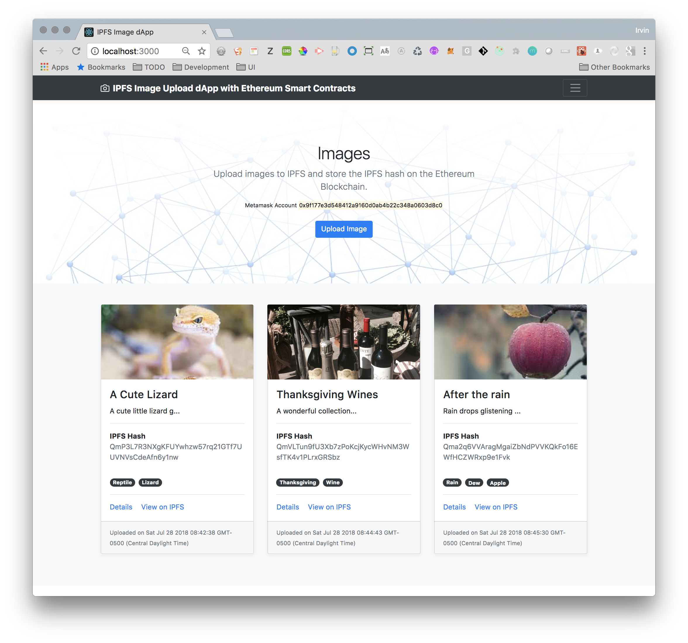
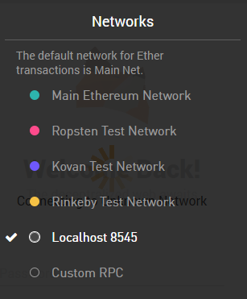
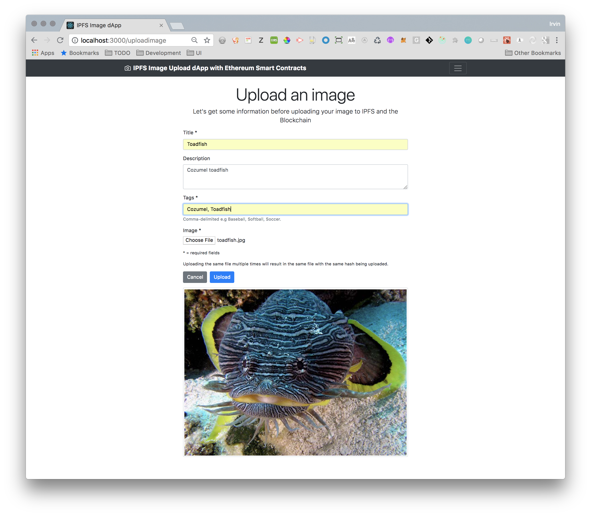
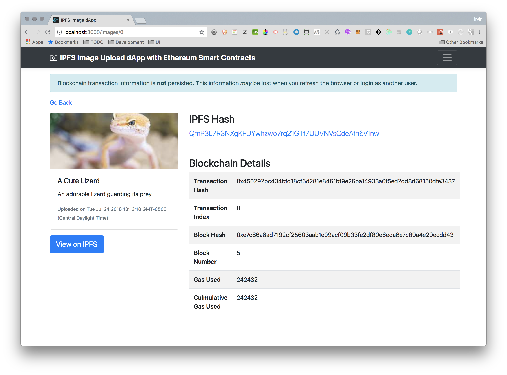

# IPFS Image dApp



## Overview

IPFS and blockchain are a perfect combination for decentralized and immutable storage. This project is an Ethereum Decentralized Application (**dApp**) built using **React, Redux, React Router, and Bootstrap**. It allows users to upload images to **IPFS**, store their hashes on the blockchain, and view them securely.

### Key Features
- **Decentralized Storage**: Upload images to IPFS and store references on Ethereum.
- **Secure & Immutable**: Image timestamps and proofs of existence.
- **User Ownership**: Only the uploader (MetaMask account) can see their images.
- **Modern Web Stack**: Built with React, Redux, Bootstrap, and Web3.js.

---

## Demo







---

## Tech Stack

- **Smart Contracts**: Solidity
- **Decentralized Storage**: IPFS (via Infura)
- **Blockchain Development**: Truffle, Ganache
- **Frontend**: React, Redux, Bootstrap 4
- **Web3 Provider**: MetaMask
- **Security & Utility**: OpenZeppelin

---

## Installation & Setup

### Prerequisites
- **MetaMask** plugin installed on Chrome
- **Node.js** installed
- **Truffle** and **Ganache CLI** installed globally:
  ```sh
  npm install -g truffle
  npm install -g ganache-cli
  ```

### Setup Steps
1. **Start a local Ethereum blockchain:**
   ```sh
   ganache-cli -b 3
   ```
2. **Compile and deploy smart contracts:**
   ```sh
   truffle compile
   truffle migrate --reset --compile-all
   ```
3. **Start the application:**
   ```sh
   npm run start
   ```
4. **Open the app** in a browser: [http://localhost:3000](http://localhost:3000)
5. **Connect MetaMask** to your local Ganache Ethereum account:
   - Connect to `http://127.0.0.1:8545`
   - Import an account using the Ganache seed phrase

---

## Usage Guide

### Uploading an Image
1. Click **Upload Image**
2. Enter an **image title**, optional **description**, and **tags**
3. Click **Upload** to submit the image to IPFS and store its hash on the blockchain

### Viewing Image Details
- Click **Details** on an image card to view full blockchain transaction details

### Storage Handling
- **Images are stored on IPFS** and their hashes are stored on the Ethereum blockchain
- **Blockchain transaction data is stored in browser local storage** for better UX
- **Data is transient** when running Ganache; clear local storage before restarting

---

## Testing

### Run Unit Tests
```sh
truffle test
```

### Solidity Coverage Report
```sh
npm run coverage:solidity
```

#### Sample Test Output:
```
  Contract: ImageRegister
    ✓ has an owner
    ✓ should store an image
    ✓ should emit a LogImageUploaded event when storing an image
    ✓ should return image details
    ✓ should store images for multiple owners
  17 passing (2s)
```
## Deployment to Rinkeby TestNet

### Steps to Deploy
1. **Get an Infura API Key** (Sign up for free on Infura)
2. **Create a `.env` file** in the root directory and add:
   ```sh
   MNENOMIC='<Your MetaMask recovery words>'
   INFURA_API_KEY='<Your Infura API Key>'
   ```
3. **Deploy the smart contract:**
   ```sh
   truffle migrate --reset --compile-all --network rinkeby
   ```

---

## Troubleshooting Tips

- **Is Ganache running?** Ensure it's started with `ganache-cli`.
- **Is MetaMask connected to the right network?** Connect to `http://127.0.0.1:8545`.
- **Are transactions failing?** Try resetting your MetaMask account.
- **Are images not appearing?** Transactions on Rinkeby may take a minute to mine.

---

## Future Enhancements

- ✅ Add a visual indicator for image uploads in progress
- ✅ Improve web3 error handling with React error boundaries
- ✅ Implement search and filtering by tags
- ✅ Enable video uploads
- ✅ Enhance UI/UX with a step-by-step image upload wizard

---

## Resources
- [Ethereum](https://ethereum.org/)
- [Truffle Suite](https://www.trufflesuite.com/)
- [OpenZeppelin](https://openzeppelin.com/)
- [IPFS](https://ipfs.io/)

---
